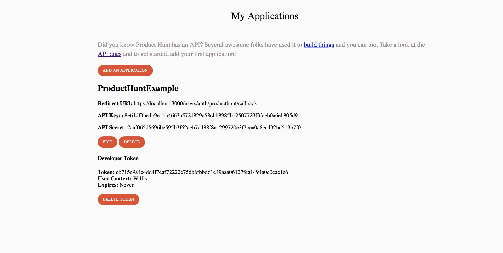

Product Hunt is an amazing platform to discover new apps and projects. We'll be making it much easier to discover the best ones that have been released recently.

# Checkout Product Hunt

You will need to sign up for Product Hunt, register an application, and generate the token needed to use the API in our app.

1. Explore the [website](https://www.producthunt.com/)
2. Create a Product Hunt account.
3. Read the [API docs](https://api.producthunt.com/v1/docs/); this gives you all the information you need to use the API.

# Create An Application

In order to use the API, we'll have to register the application on product hunt.

1. Navigate to the [API dashboard](https://api.producthunt.com/v1/oauth/applications) and create a new application.
2. Click API dashboard at top right.
3. Click Add application.
4. Give your application a name and this redirect URI: `https://localhost:3000/users/auth/producthunt/callback`
5. Click create token to generate your access token.

Your dashboard should look similar to this:

# Make a GET Request with Postman

Now that we have access to the API, let's check out the structure of the data we'll be receiving.

Postman is an API Development Environment (ADE), an awesome tool for any developer working with API's. We'll be using it in this tutorial to make network requests to the Product Hunt API to test and analyze the data we get.

1. Download the [Postman desktop app](https://www.getpostman.com/) from their website if you don't have it already. You don't need an account to use Postmam.
2. Upon opening Postman, you should see this welcome screen:

1. Choose **Request** under building blocks to create a new request.
    - You can name the request whatever you want and save it whichever collection you choose; For this tutorial I'll be naming the request **Get Posts** and saving it in the **Product Hunt** collection.
2. Paste this URL into the URL field at the top of the window: `https://api.producthunt.com/v1/posts/all?sort_by=votes_count&order=desc&search[featured]=true&per_page=20`
3. Let's break down the URL:
    - `api.producthunt.com/v1` is the **base URL** for this API.
    - `posts/all` is the **endpoint** or **route** which gives you access to every product posted on Product Hunt (as long as you have a valid token!).
    - Everything after the **_?_** are the **paramaters** of our request and each parameter is seperated by **_&'s_**.
      - `sort_by=votes_count` and `order=desc` denotes that we want the resulting data to be organized by the number of votes in descending order.
      - `search[featured]=true` makes it so that we only get featured posts.
      - `per_page=20` limits the amount of posts we get to only 20. There are thousands of products listed on product hunt, we'll only need to get 20 at a time for our app.
4. Hit send. You should receive JSON data as a response to your request. This is what you should see:

# Analyze Response

What you received from your request is known as JSON (Javascript Object Notation), a text format that is completely language independent and easy to read.

How the data in the JSON response is organized is extremely important, especially for our app. We'll need to understand the hierarcy of the data so that we can pull out the right information.

See if you can find the first product's name, tagline, number of votes, and screenshot URL.